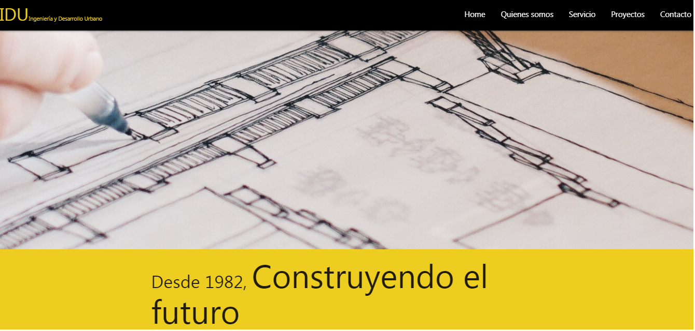
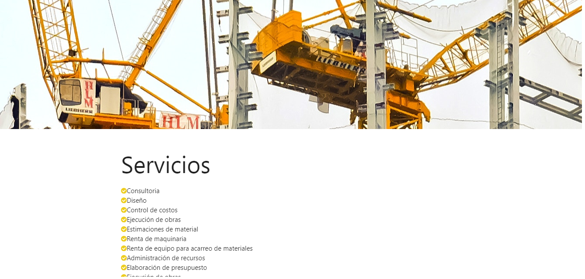
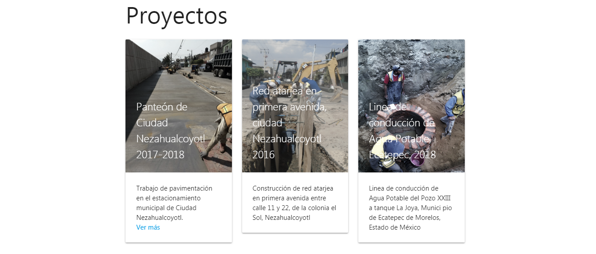

# IDU, Ingenieria y Desarrollo Urbano

## Tecnologías empleadas en este proyecto:
* HTML
* CSS
* PHOTOSHOP
* MATERILIZE

Se presenta el diseño, maquetado y funcionalidad, de una pagina web, para la constructora IDU, la cual brinda servicios de
Consultoria
Diseño
Control de costos
Ejecución de obras
Estimaciones de material
Renta de maquinaria
Renta de equipo para acarreo de materiales
Administración de recursos
Elaboración de presupuesto
Ejecución de obras

Posteriormente, se despliegan las soluciones que presentan en los diferentes campos de la construcción

Finalmente, algunos de los proyectos concluidos exitosamente y los medios de contacto.

Para ver el sitio completo puedes entrar a: [sitio original]( https://indezende.github.io/constructora/).

##### “Desarrollado para [IDU, Ingeniería y Desarrollo Urbano]”  
